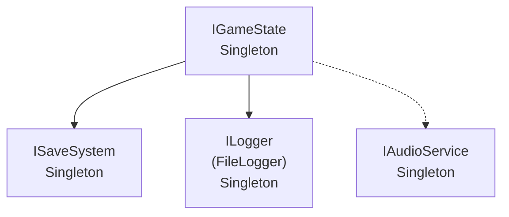
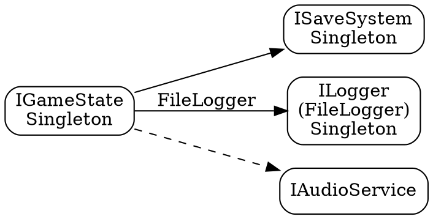

# Godot C# Service Locator - Complete Documentation

## Table of Contents
1. [Overview](#overview)
2. [Installation](#installation)
3. [Quick Start](#quick-start)
4. [Core Features](#core-features)
5. [Advanced Usage](#advanced-usage)
6. [API Reference](#api-reference)
7. [Best Practices](#best-practices)
8. [Examples](#examples)

---

## Overview

An elegant, feature-rich Service Locator implementation for Godot with C# that provides:

- **Automatic Service Discovery** - Services register themselves using attributes
- **Dependency Injection** - Constructor and member injection
- **Multiple Lifetimes** - Singleton, Transient, and Scoped services
- **Lazy Loading** - Services load only when needed
- **Async Initialization** - Support for async service startup
- **Event System** - Track service registration and resolution
- **Service Scopes** - Isolated service instances for specific contexts
- **Factory Pattern** - Register services via factory methods
- **Lifecycle Management** - Automatic disposal of services

---

## Installation

### 1. Add ServiceLocator as Autoload

1. Copy the Service Locator code to your project (e.g., `Scripts/ServiceLocator.cs`)
2. Open **Project → Project Settings → Autoload**
3. Add ServiceLocator:
   - **Path**: `res://Scripts/ServiceLocator.cs`
   - **Node Name**: `ServiceLocator`
   - Enable **Singleton**

### 2. Create Your Services

Services are automatically discovered and registered when marked with `[Service]` attribute.

---

## Quick Start

### Step 1: Define an Interface
```csharp
public interface IScoreService
{
    int Score { get; }
    void AddScore(int points);
}
```

### Step 2: Implement with [Service] Attribute
```csharp
[Service(typeof(IScoreService))]
public class ScoreService : IScoreService
{
    public int Score { get; private set; }
    
    public void AddScore(int points)
    {
        Score += points;
        GD.Print($"Score: {Score}");
    }
}
```

### Step 3: Use in Your Nodes
```csharp
public partial class Player : CharacterBody2D
{
    [Inject] private IScoreService _scoreService;

    public override void _Ready()
    {
        ServiceLocator.InjectMembers(this);
    }

    public void CollectCoin()
    {
        _scoreService?.AddScore(10);
    }
}
```

That's it! The service is automatically registered and injected.

---

## Core Features

### 1. Service Lifetimes

#### Singleton (Default)
One instance shared across the entire application.
```csharp
[Service(typeof(IGameState), ServiceLifetime.Singleton)]
public class GameStateService : IGameState { }
```

#### Transient
New instance created each time the service is requested.
```csharp
[Service(typeof(IWeapon), ServiceLifetime.Transient)]
public class Weapon : IWeapon { }
```

#### Scoped
One instance per scope (useful for level-specific services).
```csharp
[Service(typeof(ILevelData), ServiceLifetime.Scoped)]
public class LevelData : ILevelData { }
```

### 2. Dependency Injection

#### Constructor Injection
```csharp
[Service(typeof(IPlayerService))]
public class PlayerService : IPlayerService
{
    private readonly IScoreService _scoreService;
    private readonly IAudioService _audioService;

    // Dependencies automatically resolved via constructor
    public PlayerService(IScoreService scoreService, IAudioService audioService)
    {
        _scoreService = scoreService;
        _audioService = audioService;
    }
}
```

#### Property/Field Injection
```csharp
public class GameController
{
    [Inject] private IGameState _gameState;
    [Inject] private IAudioService _audio;
    
    // Optional dependency - won't log error if missing
    [Inject(optional: true)] private IAnalytics _analytics;
}
```

### 3. Service Priority

Control initialization order with priority (higher = first).
```csharp
[Service(typeof(IConfigService), priority: 100)]
public class ConfigService : IConfigService { }

[Service(typeof(IAudioService), priority: 10)]
public class AudioService : IAudioService { }
```

### 4. Lazy Loading

Defer service creation until first use.
```csharp
[Service(typeof(IHeavyService), lazy: true)]
public class HeavyService : IHeavyService
{
    public HeavyService()
    {
        // Only called when service is first requested
        GD.Print("Heavy initialization...");
    }
}
```

### 5. Post-Injection Callbacks

Run code after all dependencies are injected.
```csharp
[Service(typeof(INetworkService))]
public class NetworkService : INetworkService
{
    [Inject] private IConfigService _config;

    [PostInject]
    private void OnPostInject()
    {
        // All dependencies are now available
        var serverUrl = _config.GetServerUrl();
        Connect(serverUrl);
    }
}
```

### 6. Async Initialization

Initialize services asynchronously.
```csharp
[Service(typeof(ISaveSystem))]
public class SaveSystem : ISaveSystem
{
    [Initialize]
    private async Task InitializeAsync()
    {
        await LoadDataFromDisk();
        GD.Print("Save system ready!");
    }
}

// In GameManager
public override async void _Ready()
{
    await ServiceLocator.InitializeServicesAsync();
    // All services with [Initialize] are now ready
}
```

---

## Advanced Usage

### Factory Registration

Register services using factory methods.
```csharp
ServiceLocator.RegisterFactory<IRandomService>(() => 
{
    return new RandomService(GD.Randf());
});
```

### Manual Registration

Register services without attributes.
```csharp
// Register interface to implementation
ServiceLocator.Register<IAudioService, AudioService>(ServiceLifetime.Singleton);

// Register specific instance
var audioService = new AudioService();
ServiceLocator.Register(audioService);
```

### Service Scopes

Create isolated service contexts (useful for levels, game modes).
```csharp
public partial class LevelManager : Node
{
    private ServiceLocator.ServiceScope _levelScope;

    public void LoadLevel()
    {
        _levelScope = ServiceLocator.CreateScope("Level1");
        
        var levelData = _levelScope.Get<ILevelData>();
        // Use level-specific services
    }

    public void UnloadLevel()
    {
        ServiceLocator.DisposeScope("Level1");
    }
}
```

### Event Bus Pattern

Built-in event bus for decoupled communication.
```csharp
[Service(typeof(IEventBus))]
public class EventBus : IEventBus
{
    public void Publish<T>(T evt) { }
    public void Subscribe<T>(Action<T> handler) { }
}

// Usage
public class PlayerDiedEvent { public string PlayerName; }

// Publisher
_eventBus.Publish(new PlayerDiedEvent { PlayerName = "Player1" });

// Subscriber
_eventBus.Subscribe<PlayerDiedEvent>(evt => 
{
    GD.Print($"{evt.PlayerName} died!");
});
```

### Service Resolution

Multiple ways to retrieve services:
```csharp
// Direct get (throws error if not found)
var audio = ServiceLocator.Get<IAudioService>();

// Safe get (returns null if not found)
var audio = ServiceLocator.GetOrDefault<IAudioService>();

// Try get pattern
if (ServiceLocator.TryGet<IAudioService>(out var audio))
{
    audio.PlaySfx(sound);
}

// Get all services of type
var allLoggers = ServiceLocator.GetAll<ILogger>();
```

### Service Events

React to service lifecycle events:
```csharp
ServiceLocator.OnServiceRegistered += type => 
{
    GD.Print($"Registered: {type.Name}");
};

ServiceLocator.OnServiceResolved += type => 
{
    GD.Print($"Resolved: {type.Name}");
};
```

---

## API Reference

### Attributes

| Attribute | Target | Description |
|-----------|--------|-------------|
| `[Service(interfaceType, lifetime, priority, lazy, name)]` | Class | Marks class as auto-registered service with optional name |
| `[Inject(optional, name)]` | Property/Field | Marks member for dependency injection with optional name |
| `[PostInject]` | Method | Called after dependencies are injected |
| `[Initialize]` | Method | Called during async initialization |
| `[Decorator(serviceType, order)]` | Class | Marks class as decorator for specific service |

### Core Methods

| Method | Description |
|--------|-------------|
| `Register<TInterface, TImpl>(lifetime, lazy, name)` | Register service with optional name |
| `Register<T>(instance, name)` | Register service instance with optional name |
| `RegisterFactory<T>(factory, lifetime, name)` | Register via factory with optional name |
| `RegisterDecorator<TService, TDecorator>(order)` | Register decorator for service |
| `UseMiddleware(middleware)` | Add middleware to resolution pipeline |
| `Get<T>(name)` | Resolve service by type and optional name |
| `GetOrDefault<T>(name)` | Resolve service (null if not found) |
| `TryGet<T>(out service, name)` | Try to resolve service |
| `GetAll<T>()` | Get all services of type |
| `GetAllNamed<T>()` | Get all named services as dictionary |
| `Has<T>(name)` | Check if service is registered |
| `Unregister<T>(name)` | Remove service registration |
| `InjectMembers(target)` | Inject dependencies into object |
| `CreateScope(name)` | Create service scope |
| `DisposeScope(name)` | Dispose service scope |
| `InitializeServicesAsync()` | Initialize all services asynchronously |
| `PrintServices()` | Debug: print all services, decorators, middleware |
| `PrintDependencyGraph()` | Print dependency graph with cycle detection |
| `BuildDependencyGraph()` | Build graph object for programmatic analysis |
| `ExportDependencyGraphMermaid()` | Export graph as Mermaid diagram |
| `ExportDependencyGraphDot()` | Export graph as DOT (Graphviz) format |
| `SaveDependencyGraphToFile(path, format)` | Save graph to file |
| `Reset()` | Clear and re-register all services |

---

## Best Practices

### 1. Program to Interfaces
Always use interfaces for your services:
```csharp
// ✅ Good
[Inject] private IAudioService _audio;

// ❌ Bad
[Inject] private AudioService _audio;
```

### 2. Keep Services Stateless When Possible
Services should be lightweight and focus on behavior, not state storage.

### 3. Use Constructor Injection for Required Dependencies
```csharp
public class GameService
{
    // Required - injected via constructor
    private readonly IScoreService _score;
    
    // Optional - injected via property
    [Inject(optional: true)] private IAnalytics _analytics;
    
    public GameService(IScoreService score)
    {
        _score = score;
    }
}
```

---

## Practical Guide: Modules provide implementations (Recommended)

This section shows a practical pattern for building a modular system where the core defines service interfaces and modules provide concrete implementations (Dependency Inversion Principle).

### Overview
- **Core**: defines service interfaces and contracts (no implementations). Keep interfaces stable and minimal.
- **Module**: implements and registers services during its lifecycle. Modules can be enabled/disabled independently.
- **Resolution**: other modules and game code depend on interfaces (via constructor/property injection or ServiceLocator lookup).

### Why this pattern?
- Low coupling: components depend on interfaces, not concrete classes.
- Testability: swap implementations or mock services in tests.
- Extensibility: modules add/replace functionality without changing core code.

### Step-by-step practical example

1) Define the interface in core

```csharp
// In Core project (stable contract)
public interface IInputService
{
    bool IsActionPressed(string action);
    void RegisterAction(string name, Key key);
}
```

2) Implement the service in a module

```csharp
// In Input module
[Service(typeof(IInputService), ServiceLifetime.Singleton)]
public class InputService : IInputService
{
    public bool IsActionPressed(string action) => Input.IsActionPressed(action);
    public void RegisterAction(string name, Key key) => InputMap.AddAction(name);
}
```

3) Register the service (automatic via attribute OR manual)

- Attribute registration (recommended when your ServiceLocator scans attributes):
  - `[Service(typeof(IInputService))]` on `InputService` will register it automatically.

- Manual registration inside your module (gives explicit control):

```csharp
public partial class InputModule : Node, IModule
{
    public void Initialize()
    {
        // Register the implementation explicitly
        ServiceLocator.Register<IInputService, InputService>(ServiceLifetime.Singleton);

        // OR register an instance
        // ServiceLocator.Register<IInputService>(new InputService());
    }

    public void Cleanup()
    {
        // Unregister on cleanup to avoid stale registrations when module is disabled
        ServiceLocator.Unregister<IInputService>();
    }
}
```

4) Use the service (consumers should depend on the interface)

- Constructor injection (preferred for required dependencies)

```csharp
public class PlayerController
{
    private readonly IInputService _input;

    public PlayerController(IInputService input)
    {
        _input = input;
    }

    public void Process()
    {
        if (_input.IsActionPressed("jump")) Jump();
    }
}
```

- Field/property injection (useful in Nodes)

```csharp
public partial class PlayerNode : Node
{
    [Inject] private IInputService _input;

    public override void _Ready()
    {
        ServiceLocator.InjectMembers(this);
    }
}
```

5) Declaring module dependencies and load order

Ensure modules that provide required services load before modules that depend on them. Use module metadata:

```csharp
[Module("Input", AutoLoad = true, LoadOrder = 10)]
public class InputModule : Node, IModule { }

[Module("Player", AutoLoad = true, LoadOrder = 20)]
public class PlayerModule : Node, IModule { }
```

Or check for required services in `Initialize()` and fail fast with clear errors if missing:

```csharp
public void Initialize()
{
    if (!ServiceLocator.Has<IInputService>())
        throw new InvalidOperationException("IInputService is required by PlayerModule but was not registered.");
}
```

6) Supporting multiple implementations and overrides

You can replace or decorate implementations by registering later with higher priority or by using named registrations:

```csharp
// Register a different implementation (overrides previous when resolving the default)
ServiceLocator.Register<IInputService, ExperimentalInputService>(priority: 200);

// Or register a named implementation
ServiceLocator.Register<IInputService, LegacyInputService>(name: "legacy");
var legacy = ServiceLocator.Get<IInputService>("legacy");
```

7) Scoped services (per-level or per-session)

Use scopes when a service should not be global:

```csharp
var levelScope = ServiceLocator.CreateScope("level-1");
levelScope.Register<ILevelState, LevelState>();
// Resolve within scope
var state = levelScope.Get<ILevelState>();
```

### Best Practices Checklist
- Program to interfaces in the core.
- Register/unregister services in `Initialize()` / `Cleanup()` of modules.
- Prefer constructor injection for required dependencies; use property injection for optional or framework-bound members.
- Use `[PostInject]` or a dedicated initialization method if service needs other injected dependencies before starting.
- Fail fast with clear errors when required services are missing.
- Keep services small, focused, and ideally stateless.
- Document service contracts and any versioning policy.
- Write unit tests that mock or stub services via the ServiceLocator's registration API.

### Troubleshooting
- Error: "Service not found" → check module load order, ensure provider module registered before consumer initializes.
- Error: inconsistent instances → ensure you aren't accidentally registering both singleton and transient versions unless intended.
- Memory leaks after module reload → ensure `Cleanup()` unregisters or disposes scoped instances.

---

### 4. Dispose Resources Properly
Implement `IDisposable` for services that hold resources:
```csharp
[Service(typeof(INetworkService))]
public class NetworkService : INetworkService, IDisposable
{
    public void Dispose()
    {
        // Cleanup resources
        DisconnectFromServer();
    }
}
```

### 5. Use Scopes for Temporary Contexts
```csharp
// Level-specific services
var levelScope = ServiceLocator.CreateScope("Level1");
// ... use services
ServiceLocator.DisposeScope("Level1");
```

### 6. Initialize Services on Startup
```csharp
public partial class GameManager : Node
{
    public override async void _Ready()
    {
        await ServiceLocator.InitializeServicesAsync();
        StartGame();
    }
}
```

---

## Examples

### Complete Audio Service
```csharp
public interface IAudioService
{
    void PlayMusic(AudioStream stream, float volume = 1.0f);
    void PlaySfx(AudioStream stream);
    void StopMusic();
}

[Service(typeof(IAudioService), priority: 10)]
public class AudioService : IAudioService
{
    [Inject] private IConfigService _config;
    
    private AudioStreamPlayer _musicPlayer;
    private AudioStreamPlayer _sfxPlayer;

    [PostInject]
    private void Setup()
    {
        _musicPlayer = new AudioStreamPlayer();
        _sfxPlayer = new AudioStreamPlayer();
        
        _musicPlayer.Bus = "Music";
        _sfxPlayer.Bus = "SFX";
    }

    public void PlayMusic(AudioStream stream, float volume = 1.0f)
    {
        _musicPlayer.Stream = stream;
        _musicPlayer.VolumeDb = Mathf.LinearToDb(volume);
        _musicPlayer.Play();
    }

    public void PlaySfx(AudioStream stream)
    {
        _sfxPlayer.Stream = stream;
        _sfxPlayer.Play();
    }

    public void StopMusic()
    {
        _musicPlayer.Stop();
    }
}
```

### Game State with Save System
```csharp
public interface IGameState
{
    int Score { get; }
    int Level { get; }
    void SaveGame();
    Task LoadGameAsync();
}

[Service(typeof(IGameState))]
public class GameState : IGameState
{
    [Inject] private ISaveSystem _saveSystem;
    [Inject] private IEventBus _eventBus;

    public int Score { get; private set; }
    public int Level { get; private set; }

    [Initialize]
    private async Task InitializeAsync()
    {
        await LoadGameAsync();
    }

    public void AddScore(int points)
    {
        Score += points;
        _eventBus.Publish(new ScoreChangedEvent { NewScore = Score });
        SaveGame();
    }

    public void SaveGame()
    {
        var data = new SaveData { Score = Score, Level = Level };
        _saveSystem.Save("game_state", data);
    }

    public async Task LoadGameAsync()
    {
        var data = await _saveSystem.LoadAsync<SaveData>("game_state");
        if (data != null)
        {
            Score = data.Score;
            Level = data.Level;
        }
    }
}
```

### Player with Multiple Services
```csharp
public partial class Player : CharacterBody2D
{
    [Inject] private IGameState _gameState;
    [Inject] private IAudioService _audio;
    [Inject] private IInputService _input;
    [Inject(optional: true)] private IAnalytics _analytics;

    [Export] private AudioStream _jumpSound;
    [Export] private AudioStream _coinSound;

    public override void _Ready()
    {
        ServiceLocator.InjectMembers(this);
        _analytics?.TrackEvent("player_spawned");
    }

    public override void _PhysicsProcess(double delta)
    {
        if (_input.IsJumpPressed() && IsOnFloor())
        {
            Jump();
        }
    }

    private void Jump()
    {
        Velocity = new Vector2(Velocity.X, -400);
        _audio.PlaySfx(_jumpSound);
    }

    public void CollectCoin()
    {
        _gameState.AddScore(10);
        _audio.PlaySfx(_coinSound);
        _analytics?.TrackEvent("coin_collected");
    }
}
```

---

## Troubleshooting

### Services Not Auto-Registering
- Ensure ServiceLocator is added as an **Autoload** in Project Settings
- Check that your service classes are marked with `[Service]` attribute
- Verify the service class is in the same assembly

### Injection Not Working
- Call `ServiceLocator.InjectMembers(this)` in `_Ready()`
- Ensure properties/fields are marked with `[Inject]`
- Check that services are registered before injection

### Circular Dependencies
- Use `ServiceLocator.PrintDependencyGraph()` to detect cycles
- Avoid circular dependencies in constructor injection
- Use property injection with `[Inject]` for one side of the dependency
- Consider restructuring your service architecture

### Performance Concerns
- Use `lazy: true` for heavy services
- Prefer singleton lifetime for most services
- Use scopes for temporary service contexts

---

## Dependency Graph Visualization

### Overview
Automatically analyze and visualize your service dependencies to understand relationships, detect circular dependencies, and determine optimal initialization order.

### Basic Usage

#### Print Dependency Graph to Console
```csharp
public override void _Ready()
{
    ServiceLocator.PrintDependencyGraph();
}
```

**Output:**
```
=== Dependency Graph ===

[IGameState]
  Implementation: GameStateService
  Lifetime: Singleton
  Dependencies:
    → ISaveSystem [Required] via Constructor
    → ILogger (FileLogger) [Required] via Property: _fileLogger
    → ILogger (ConsoleLogger) [Required] via Property: _consoleLogger

[ISaveSystem]
  Implementation: SaveSystem
  Lifetime: Singleton
  Dependencies: None

[IAudioService]
  Implementation: AudioService
  Lifetime: Singleton
  Dependencies:
    → IConfigService [Optional] via Field: _config

✓ No circular dependencies detected

=== Recommended Initialization Order ===
  1. ISaveSystem
  2. ILogger (FileLogger)
  3. ILogger (ConsoleLogger)
  4. IGameState
  5. IConfigService
  6. IAudioService
```

### Circular Dependency Detection

The system automatically detects circular dependencies:

```csharp
// BAD: Circular dependency
[Service(typeof(IServiceA))]
public class ServiceA : IServiceA
{
    public ServiceA(IServiceB serviceB) { } // Depends on B
}

[Service(typeof(IServiceB))]
public class ServiceB : IServiceB
{
    public ServiceB(IServiceA serviceA) { } // Depends on A
}
```

**Console Output:**
```
⚠️  CIRCULAR DEPENDENCIES DETECTED:
  → IServiceA → IServiceB → IServiceA
```

**Fix:**
```csharp
// GOOD: Break the cycle with property injection
[Service(typeof(IServiceA))]
public class ServiceA : IServiceA
{
    [Inject] private IServiceB _serviceB; // Property injection
}

[Service(typeof(IServiceB))]
public class ServiceB : IServiceB
{
    public ServiceB(IServiceA serviceA) { } // Constructor injection
}
```

### Export to Mermaid

Generate Mermaid diagrams for documentation or visualization tools:

```csharp
// Export as Mermaid markdown
string mermaid = ServiceLocator.ExportDependencyGraphMermaid();
GD.Print(mermaid);

// Save to file
ServiceLocator.SaveDependencyGraphToFile(
    "res://docs/dependency_graph.md", 
    GraphFormat.Mermaid
);
```

**Generated Mermaid:**


You can view this in:
- GitHub (renders Mermaid automatically)
- VS Code (with Mermaid extension)
- Online viewers like [mermaid.live](https://mermaid.live)

### Export to DOT (Graphviz)

Generate DOT format for use with Graphviz tools:

```csharp
// Export as DOT format
string dot = ServiceLocator.ExportDependencyGraphDot();

// Save to file
ServiceLocator.SaveDependencyGraphToFile(
    "res://docs/dependency_graph.dot", 
    GraphFormat.Dot
);
```

**Generated DOT:**


Convert to PNG using Graphviz:
```bash
dot -Tpng dependency_graph.dot -o dependency_graph.png
```

### Dependency Graph API

#### Build Graph Programmatically
```csharp
var graph = ServiceLocator.BuildDependencyGraph();

// Access nodes
foreach (var node in graph.Nodes)
{
    GD.Print($"Service: {node.ServiceType.Name}");
    GD.Print($"  Implementation: {node.ImplementationType.Name}");
    GD.Print($"  Lifetime: {node.Lifetime}");
    
    foreach (var dep in node.Dependencies)
    {
        GD.Print($"  → {dep.DependencyType.Name} ({dep.InjectionPoint})");
    }
}
```

#### Detect Circular Dependencies
```csharp
var graph = ServiceLocator.BuildDependencyGraph();
var cycles = graph.DetectCircularDependencies();

if (cycles.Count > 0)
{
    GD.PrintErr("Found circular dependencies!");
    foreach (var cycle in cycles)
    {
        var path = string.Join(" → ", cycle.Select(t => t.Name));
        GD.PrintErr($"  {path}");
    }
}
```

#### Get Initialization Order
```csharp
var graph = ServiceLocator.BuildDependencyGraph();
var order = graph.GetInitializationOrder();

GD.Print("Initialize in this order:");
foreach (var node in order)
{
    GD.Print($"  {node.ServiceType.Name}");
}
```

### Dependency Information

The graph provides detailed information about each dependency:

```csharp
public class ServiceDependency
{
    public Type DependencyType { get; set; }      // What service is needed
    public string DependencyName { get; set; }    // Named service key
    public bool IsRequired { get; set; }          // Required or optional
    public string InjectionPoint { get; set; }    // Where it's injected
}
```

**Injection Points:**
- `"Constructor"` - Constructor parameter
- `"Property: PropertyName"` - Property injection
- `"Field: FieldName"` - Field injection

### Advanced Usage

#### Custom Analysis
```csharp
var graph = ServiceLocator.BuildDependencyGraph();

// Find services with most dependencies
var mostComplex = graph.Nodes
    .OrderByDescending(n => n.Dependencies.Count)
    .Take(5);

GD.Print("Most complex services:");
foreach (var node in mostComplex)
{
    GD.Print($"  {node.ServiceType.Name}: {node.Dependencies.Count} dependencies");
}

// Find services with no dependencies (leaf nodes)
var leafNodes = graph.Nodes
    .Where(n => n.Dependencies.Count == 0);

GD.Print("Leaf services (no dependencies):");
foreach (var node in leafNodes)
{
    GD.Print($"  {node.ServiceType.Name}");
}

// Find services that nothing depends on (root nodes)
var allDependencies = graph.Nodes
    .SelectMany(n => n.Dependencies.Select(d => d.DependencyType))
    .ToHashSet();

var rootNodes = graph.Nodes
    .Where(n => !allDependencies.Contains(n.ServiceType));

GD.Print("Root services (nothing depends on them):");
foreach (var node in rootNodes)
{
    GD.Print($"  {node.ServiceType.Name}");
}
```

#### Generate Dependency Report
```csharp
public void GenerateDependencyReport()
{
    var graph = ServiceLocator.BuildDependencyGraph();
    var report = new System.Text.StringBuilder();
    
    report.AppendLine("# Service Dependency Report");
    report.AppendLine($"Generated: {DateTime.Now}");
    report.AppendLine($"Total Services: {graph.Nodes.Count}");
    report.AppendLine();
    
    // Statistics
    var totalDeps = graph.Nodes.Sum(n => n.Dependencies.Count);
    var avgDeps = graph.Nodes.Count > 0 ? totalDeps / (double)graph.Nodes.Count : 0;
    
    report.AppendLine("## Statistics");
    report.AppendLine($"- Total Dependencies: {totalDeps}");
    report.AppendLine($"- Average Dependencies per Service: {avgDeps:F2}");
    report.AppendLine();
    
    // Circular dependencies
    var cycles = graph.DetectCircularDependencies();
    if (cycles.Count > 0)
    {
        report.AppendLine("## ⚠️ Issues");
        report.AppendLine("### Circular Dependencies");
        foreach (var cycle in cycles)
        {
            var path = string.Join(" → ", cycle.Select(t => t.Name));
            report.AppendLine($"- {path}");
        }
        report.AppendLine();
    }
    
    // Dependency graph
    report.AppendLine("## Dependency Graph");
    report.AppendLine("```mermaid");
    report.AppendLine(graph.ToMermaid());
    report.AppendLine("```");
    
    System.IO.File.WriteAllText("res://docs/dependency_report.md", report.ToString());
}
```

### Integration with CI/CD

Generate and commit dependency graphs automatically:

```yaml
# .github/workflows/dependency-graph.yml
name: Generate Dependency Graph

on:
  push:
    branches: [main]

jobs:
  generate:
    runs-on: ubuntu-latest
    steps:
      - uses: actions/checkout@v2
      - name: Run Godot and export graph
        run: |
          godot --headless --script generate_graph.gd
      - name: Commit graph
        run: |
          git config user.name "GitHub Actions"
          git add docs/dependency_graph.md
          git commit -m "Update dependency graph" || true
          git push
```

### Use Cases

✅ **Documentation** - Auto-generate architecture diagrams  
✅ **Code Review** - Visualize impact of changes  
✅ **Onboarding** - Help new developers understand system  
✅ **Refactoring** - Identify tightly coupled services  
✅ **Debugging** - Trace dependency chains  
✅ **Testing** - Determine test order based on dependencies  
✅ **Optimization** - Find services with too many dependencies  

---

## License

This implementation is provided as-is for use in Godot C# projects.

---

## Advanced Features (NEW!)

### Named Services

Register multiple implementations of the same interface with different names.

#### Registration
```csharp
[Service(typeof(ILogger), name: "FileLogger")]
public class FileLogger : ILogger { }

[Service(typeof(ILogger), name: "ConsoleLogger")]
public class ConsoleLogger : ILogger { }
```

#### Usage
```csharp
// Inject specific named service
[Inject(name: "FileLogger")] private ILogger _fileLogger;
[Inject(name: "ConsoleLogger")] private ILogger _consoleLogger;

// Or get manually
var fileLogger = ServiceLocator.Get<ILogger>("FileLogger");
var consoleLogger = ServiceLocator.Get<ILogger>("ConsoleLogger");

// Get all named services as dictionary
var allLoggers = ServiceLocator.GetAllNamed<ILogger>();
foreach (var kvp in allLoggers)
{
    GD.Print($"Logger: {kvp.Key}");
    kvp.Value.Log("Hello!");
}
```

#### Use Cases
- Multiple database connections (primary/secondary)
- Different logging strategies (file/console/network)
- Feature flags for A/B testing
- Environment-specific configurations (dev/staging/prod)

### Service Decorators

Add cross-cutting concerns without modifying service code using the Decorator pattern.

#### Define Decorator
```csharp
[Decorator(typeof(IAudioService), order: 1)]
public class AudioLoggingDecorator : IServiceDecorator<IAudioService>
{
    public IAudioService Decorate(IAudioService instance)
    {
        return new LoggedAudioService(instance);
    }

    private class LoggedAudioService : IAudioService
    {
        private readonly IAudioService _inner;

        public LoggedAudioService(IAudioService inner)
        {
            _inner = inner;
        }

        public void PlayMusic(AudioStream stream)
        {
            GD.Print($"Playing music: {stream?.ResourcePath}");
            _inner.PlayMusic(stream);
        }

        public void PlaySfx(AudioStream stream)
        {
            GD.Print($"Playing SFX: {stream?.ResourcePath}");
            _inner.PlaySfx(stream);
        }

        public void SetMusicVolume(float volume)
        {
            _inner.SetMusicVolume(volume);
        }
    }
}
```

#### Multiple Decorators (Chaining)
```csharp
[Decorator(typeof(IAudioService), order: 1)]
public class AudioLoggingDecorator : IServiceDecorator<IAudioService> { }

[Decorator(typeof(IAudioService), order: 2)]
public class AudioCachingDecorator : IServiceDecorator<IAudioService> { }

[Decorator(typeof(IAudioService), order: 3)]
public class AudioMetricsDecorator : IServiceDecorator<IAudioService> { }

// Execution order: Metrics -> Caching -> Logging -> Original Service
```

#### Manual Registration
```csharp
ServiceLocator.RegisterDecorator<IAudioService, AudioLoggingDecorator>(order: 1);
```

#### Use Cases
- Logging/tracing method calls
- Performance monitoring
- Caching results
- Retry logic
- Authorization checks
- Input validation
- Metrics collection

### Middleware Pipeline

Process service resolution through a customizable pipeline for cross-cutting concerns.

#### Built-in Middleware

**Logging Middleware**
```csharp
public class LoggingMiddleware : IServiceMiddleware
{
    public async Task<object> InvokeAsync(ServiceContext context, Func<Task<object>> next)
    {
        GD.Print($"Resolving {context.ServiceType.Name}...");
        
        var stopwatch = Stopwatch.StartNew();
        var result = await next();
        stopwatch.Stop();
        
        GD.Print($"Resolved in {stopwatch.ElapsedMilliseconds}ms");
        return result;
    }
}
```

**Validation Middleware**
```csharp
public class ValidationMiddleware : IServiceMiddleware
{
    public async Task<object> InvokeAsync(ServiceContext context, Func<Task<object>> next)
    {
        if (context.ServiceType == null)
        {
            GD.PrintErr("Invalid service type");
            return null;
        }

        var result = await next();

        if (result == null)
        {
            GD.PrintErr($"Service {context.ServiceType.Name} returned null");
        }

        return result;
    }
}
```

**Caching Middleware**
```csharp
public class CachingMiddleware : IServiceMiddleware
{
    private readonly Dictionary<string, object> _cache = new();

    public async Task<object> InvokeAsync(ServiceContext context, Func<Task<object>> next)
    {
        var cacheKey = $"{context.ServiceType.FullName}:{context.ServiceName}";
        
        if (_cache.TryGetValue(cacheKey, out var cached))
            return cached;

        var result = await next();
        _cache[cacheKey] = result;
        return result;
    }
}
```

#### Register Middleware
```csharp
public override void _Ready()
{
    // Add middleware in order
    ServiceLocator.UseMiddleware(new LoggingMiddleware());
    ServiceLocator.UseMiddleware(new ValidationMiddleware());
    ServiceLocator.UseMiddleware(new CachingMiddleware());
    
    // Or use lambda syntax
    ServiceLocator.UseMiddleware(async (context, next) =>
    {
        GD.Print($"Custom: Before {context.ServiceType.Name}");
        var result = await next();
        GD.Print($"Custom: After {context.ServiceType.Name}");
        return result;
    });
}
```

#### ServiceContext
Access resolution context in middleware:
```csharp
public class ServiceContext
{
    public Type ServiceType { get; }          // Type being resolved
    public string ServiceName { get; }        // Named service key
    public DateTime RequestTime { get; }      // When resolution started
    public Dictionary<string, object> Data { get; } // Custom data storage
}
```

#### Custom Middleware Examples

**Performance Monitoring**
```csharp
public class PerformanceMiddleware : IServiceMiddleware
{
    public async Task<object> InvokeAsync(ServiceContext context, Func<Task<object>> next)
    {
        var stopwatch = Stopwatch.StartNew();
        var result = await next();
        stopwatch.Stop();
        
        if (stopwatch.ElapsedMilliseconds > 100)
        {
            GD.PrintErr($"Slow resolution: {context.ServiceType.Name} took {stopwatch.ElapsedMilliseconds}ms");
        }
        
        return result;
    }
}
```

**Authorization**
```csharp
public class AuthorizationMiddleware : IServiceMiddleware
{
    public async Task<object> InvokeAsync(ServiceContext context, Func<Task<object>> next)
    {
        if (context.ServiceType == typeof(IAdminService))
        {
            var user = ServiceLocator.Get<IUserService>();
            if (!user.IsAdmin)
            {
                GD.PrintErr("Unauthorized access to admin service");
                return null;
            }
        }
        
        return await next();
    }
}
```

**Rate Limiting**
```csharp
public class RateLimitMiddleware : IServiceMiddleware
{
    private readonly Dictionary<Type, DateTime> _lastAccess = new();
    private readonly TimeSpan _cooldown = TimeSpan.FromSeconds(1);

    public async Task<object> InvokeAsync(ServiceContext context, Func<Task<object>> next)
    {
        if (_lastAccess.TryGetValue(context.ServiceType, out var lastTime))
        {
            var elapsed = DateTime.UtcNow - lastTime;
            if (elapsed < _cooldown)
            {
                GD.PrintErr($"Rate limit exceeded for {context.ServiceType.Name}");
                return null;
            }
        }
        
        _lastAccess[context.ServiceType] = DateTime.UtcNow;
        return await next();
    }
}
```

#### Pipeline Execution Order
Middleware executes in the order registered:
```
Request → Middleware 1 → Middleware 2 → Middleware 3 → Service Resolution
Response ← Middleware 1 ← Middleware 2 ← Middleware 3 ← Service Instance
```

#### Use Cases
- Request/response logging
- Performance profiling
- Authorization checks
- Rate limiting
- Error handling
- Retry logic
- Circuit breakers
- Request tracing
- Metrics collection
- A/B testing

---

## Complete Example: Advanced Features

```csharp
// === SERVICES WITH NAMES ===
[Service(typeof(IDatabase), name: "Primary")]
public class PrimaryDatabase : IDatabase { }

[Service(typeof(IDatabase), name: "Secondary")]
public class SecondaryDatabase : IDatabase { }

// === DECORATOR FOR CACHING ===
[Decorator(typeof(IDatabase), order: 1)]
public class DatabaseCachingDecorator : IServiceDecorator<IDatabase>
{
    public IDatabase Decorate(IDatabase instance)
    {
        return new CachedDatabase(instance);
    }
}

// === GAME MANAGER WITH MIDDLEWARE ===
public partial class GameManager : Node
{
    public override async void _Ready()
    {
        // Setup middleware pipeline
        ServiceLocator.UseMiddleware(new LoggingMiddleware());
        ServiceLocator.UseMiddleware(new PerformanceMiddleware());
        ServiceLocator.UseMiddleware(new ValidationMiddleware());
        
        // Custom middleware for specific services
        ServiceLocator.UseMiddleware(async (context, next) =>
        {
            if (context.ServiceType == typeof(INetworkService))
            {
                // Check network availability
                if (!IsNetworkAvailable())
                {
                    GD.PrintErr("Network not available");
                    return null;
                }
            }
            return await next();
        });

        // Initialize services
        await ServiceLocator.InitializeServicesAsync();
        
        // Use named services
        var primaryDb = ServiceLocator.Get<IDatabase>("Primary");
        var secondaryDb = ServiceLocator.Get<IDatabase>("Secondary");
        
        // All database calls now go through:
        // 1. Logging middleware
        // 2. Performance middleware  
        // 3. Validation middleware
        // 4. Caching decorator
        // 5. Actual database
        
        StartGame();
    }
}
```

---

## Contributing

Suggestions for future improvements:
- Create service health checks
- Build configuration-based registration
- Add async decorators
- Implement conditional middleware
- Create service discovery mechanism